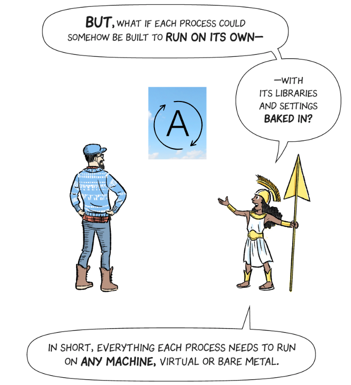

- title : First page of first presentation
- description : First page of first presentation
- author : Krystian Kolad
- theme : night
- transition : default

***

### Docker

***

### Let's begin with a story

---

---

***

### So what are containers?
 * application packed into "box"
 * "box" contains everything it needs to run
 * can run (almost) everywhere

***

### What is Docker?
 * create, manage containers
 * easy to use
 * powerfull

***

### Docker -  elements

---

### Images
 * "schema" of container
 * shareable
 * docker images

---

### Containers
 * running process
 * docker ps
 * docker run

---

### Networks
 * provides communication between containers
 * docker network

---

### Volumes
 * can store data from containers
 * when container dies, data in volume is preserved
 * docker volume

---

### Dockerfile
 * file used to create images
 * create images based on other images

---

### Docker-compose
 * group of containers, called services here
 * can also create volumes and networks
 * file in yaml style

***

# DEMO

***

### Docker hub
 * place, where you can share your images
 * everyone can download public images

***

### Orchestrators
 * provides easy way of managing containers
 * Kubernetes
 * Docker Swarm

***

### Links
 * https://cloud.google.com/kubernetes-engine/kubernetes-comic/
 * https://github.com/KrystianKolad/DockerPlayground
 * https://docs.docker.com/
 * https://hub.docker.com/